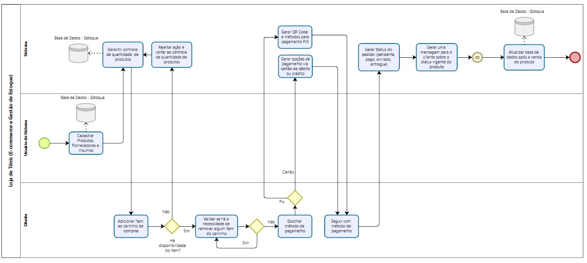

# 🛒 StockFlow

StockFlow é uma aplicação de **gestão de materiais, controle de estoque e processo de vendas**, desenvolvida como parte do projeto da disciplina **Sistemas Corporativos - 2025/1**.

---

## 🚀 Tecnologias Utilizadas

* **Backend:** .NET 8 + ASP.NET Core
* **ORM:** Entity Framework Core + Pomelo (MySQL)
* **Banco de Dados:** MySQL
* **Documentação da API:** Swagger (via Swashbuckle)
* **Versionamento:** Git + GitHub

---

## 📌 Requisitos do Projeto

* ✅ API RESTful servindo e recebendo dados em **JSON**
* ✅ Versionamento completo no Git com repositório público no **GitHub**
* ✅ Desenvolvimento em **1 Pull Request (PR)** (sem merge na `main`)
* ✅ Pelo menos **1 commit por semana** entre **29/04 e 27/05**
* ⚙️ Entregar o projeto com **README atualizado** e **diagrama BPMN**
* 📑 Defesa oral explicando a estrutura e a lógica do código

---

## ✅ Módulos do Sistema

| 🔧 Módulo                   | ✔️ Status      | 🔎 Descrição                                                 |
| --------------------------- | -------------- | -----------------------------------------------------------   |
| Gestão de materiais         | ✅ Implementado | CRUD de produtos (nome, cor, tamanho, preço, descrição)     |
| Inventário de estoque       | ✅ Implementado | Controle de estoque atrelado aos materiais                  |
| Processo de vendas          | ✅ Implementado | Vendas com controle de itens (`Sale` e `SaleItem`)          |
| Carrinho de compras         | ✅ Implementado | CRUD de itens no carrinho antes de fechar a venda           |
| Máquina de estados (vendas) | ✅ Implementado | Endpoint para atualizar status da venda                     |
| Contas a pagar              | ✅ Implementado | Cadastro de despesas, status (Pendente, Pago)               |
| Contas a receber            | ✅ Implementado | Gerado automaticamente ao criar uma venda                   |
| Gestão de funcionários      | ✅ Implementado | Cadastro de funcionários (nome, cargo, salário)             |
| Relatórios contábeis        | ✅ Implementado | Endpoint `/api/reports/financial` com resumo                |

---

## 🗂️ Estrutura do Projeto

```plaintext
StockFlowAPI/
├── Controllers/         # Controladores da API (endpoints)
├── Data/                # Configuração do DbContext (Entity Framework)
├── Interfaces/          # Interfaces de Repositories e Services
│   ├── IRepository/
│   └── IServices/
├── Models/              # Models (Entidades do banco)
├── Repositories/        # Implementações dos Repositories
├── Services/            # Implementações das regras de negócio (Services)
├── Program.cs           # Configuração do app (Swagger, Cors, DI, etc.)
├── StockFlowAPI.csproj  # Arquivo de configuração do projeto
└── README.md            # Documentação do projeto
```

---

## ▶️ Como Rodar o Projeto Localmente

### 🛠️ Pré-requisitos

* ✅ [.NET 8 SDK](https://dotnet.microsoft.com/en-us/download)
* ✅ [MySQL](https://www.mysql.com/) rodando localmente

### 📥 Clonar o repositório

```bash
git clone https://github.com/JhenyfferRidieri/StockFlow.git
cd StockFlow/StockFlowAPI
```

### ⚙️ Configurar conexão com MySQL

Edite o arquivo `appsettings.json`:

```json
{
  "ConnectionStrings": {
    "DefaultConnection": "server=localhost;database=StockFlow;user=root;password=sua_senha"
  }
}
```

### 🚀 Aplicar as migrations e gerar o banco:

```bash
dotnet ef database update
```

### ▶️ Rodar o projeto:

```bash
dotnet run
```

A API estará disponível em:

```
http://localhost:5000/swagger
```

---

## 📝 Funcionalidades do Sistema

- 🔹 Gestão de materiais (CRUD)
- 🔹 Controle de inventário (CRUD com vínculo a materiais)
- 🔹 Processo de vendas (CRUD com itens e cálculo automático do total)
- 🔹 Carrinho de compras (adicionar, editar e remover itens antes da venda)
- 🔹 Máquina de estados nas vendas (Pendente, Pago, Cancelado, Enviado, Entregue)
- 🔹 Contas a pagar (gerenciar despesas operacionais)
- 🔹 Contas a receber (geradas automaticamente nas vendas)
- 🔹 Gestão de funcionários (nome, cargo, salário, status)
- 🔹 Relatórios contábeis (vendas, contas a pagar, contas a receber, saldo)

## 🚫 Requisitos Não Funcionais

* API desenvolvida em arquitetura REST.
* Entrega dos dados no formato JSON.
* Documentação técnica no Swagger.
* Projeto versionado com Git no GitHub.
* Código desenvolvido seguindo boas práticas de Clean Code e organização em camadas.

---

## 📈 Diagrama BPMN



📥 [Clique aqui para baixar o diagrama BPMN](./StockFlowAPI/docs/bpmn-diagram.jpg)


---

## 👨‍💻 Autor

* **Jhenyffer Oliveira**
  Desenvolvido como parte do curso de **Análise e Desenvolvimento de Sistemas - Universidade Positivo (2025/1)**.

---

## ⭐ Observação

> Este projeto faz parte de uma avaliação acadêmica e foi desenvolvido exclusivamente para fins educacionais.